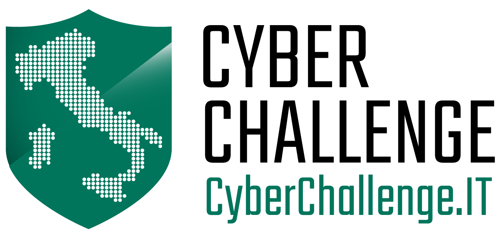

## CyberChallenge.IT

SEASON Lab is organizing the CyberChallenge.IT at Sapienza University of Rome! This is a program aimed at training in cybersecurity the best Italian students that are between 16 and 22 years old. CyberChallenge.IT is a program sponsored by the **[CINI Cybersecurity National Lab](https://www.consorzio-cini.it/)** in collaboration with the National Cybersecurity Research Committee. 

If you are young, have good programming knowledge, and want to further improve your skills, check out the official website of the event for more details: **[CyberChallenge.IT](https://cyberchallenge.it/)**.

### Local Organizers

 * Camil Demetrescu
 * Emilio Coppa
 * Daniele Cono D'Elia

### Information for enrollment

* Registrations for online test are now open. Click **[here](https://cyberchallenge.it/register)** to register now! (**Deadline: January 20, 2018**).
* Admission test:
	* Place: rooms 15 e 16, [Paolo Ercoli Laboratory](http://tiburlab.dis.uniroma1.it), via Tiburtina 205, 00185 Rome
	* Date: from 08:30 to 13:30 on February 1, 2018